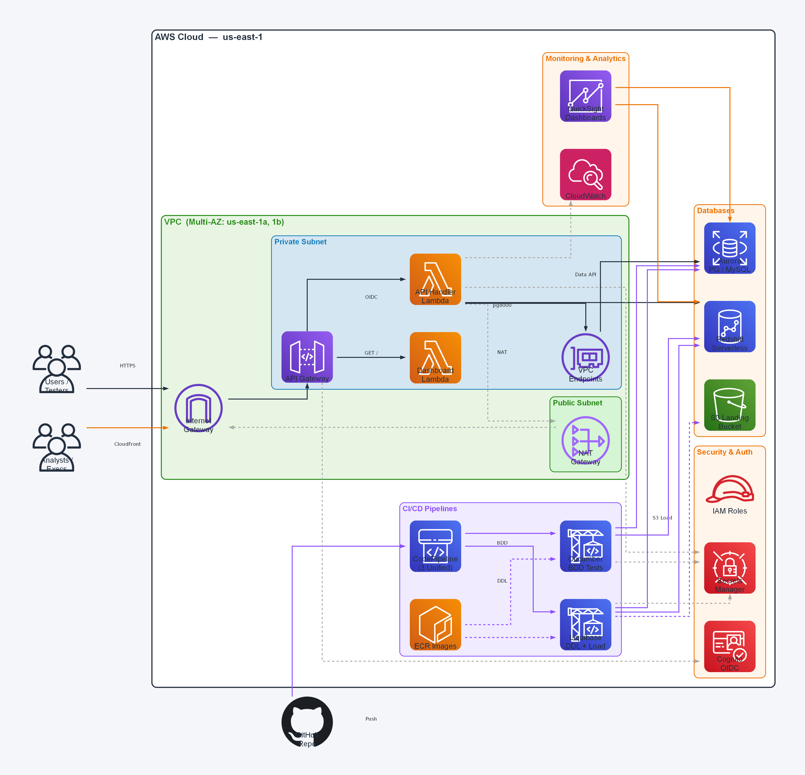
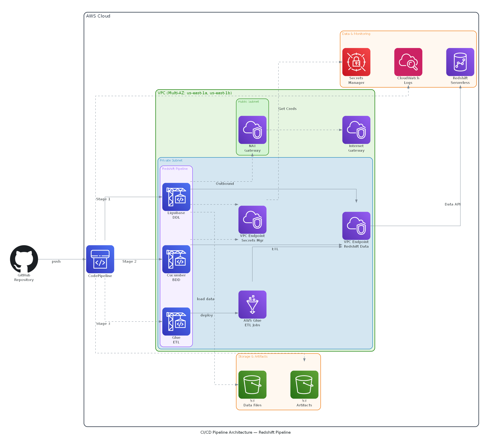

# Per-Database CodeBuild Pipelines — Liquibase + Cucumber

## Architecture

Each database has its own Docker image, buildspec, feature file, and step definitions. No cross-DB dependencies.

```
┌─────────────────────────────────────────────────────────────────────┐
│                        ECR: codebuild/db-tools                      │
│  :aurora-liquibase   Java 11, Liquibase, PostgreSQL JDBC            │
│  :redshift-liquibase Java 11, Liquibase, Redshift JDBC + extension  │
│  :aurora-tests       Python 3.9, psycopg2, behave, pytest, pyspark  │
│  :redshift-tests     Python 3.9, redshift_connector, behave, pytest │
│  :mysql-liquibase    Java 11, Liquibase, MySQL JDBC                 │
│  :mysql-tests        Python 3.9, pymysql, behave, boto3, pytest     │
└─────────────────────────────────────────────────────────────────────┘
```
## Overall Architecture

## CICD Pipeline Architecture

## Pipelines (all manual trigger, `main` branch)

| Pipeline | Source Repo | Stages | CodeBuild Projects | Docker Images |
|----------|-------------|--------|--------------------|---------------|
| `aurora-unified-pipeline` | `coding-challenge-3` | Source → Approval → Liquibase → Tests | `aurora-liquibase-build` + `aurora-tests-build` | `:aurora-liquibase` + `:aurora-tests` |
| `redshift-unified-pipeline` | `coding-challenge-3` | Source → Approval → Liquibase → Tests | `redshift-liquibase-build` + `redshift-tests-build` | `:redshift-liquibase` + `:redshift-tests` |
| `mysql-unified-pipeline` | `coding-challenge-4` | Source → Approval → Liquibase → Tests | `mysql-liquibase-build` + `mysql-tests-build` | `:mysql-liquibase` + `:mysql-tests` |
| `aurora-liquibase-pipeline` | `coding-challenge-3` | Source → Approval → Liquibase only | `aurora-liquibase-build` | `:aurora-liquibase` |
| `redshift-liquibase-pipeline` | `coding-challenge-3` | Source → Approval → Liquibase only | `redshift-liquibase-build` | `:redshift-liquibase` |
| `aurora-cucumber-pipeline` | `coding-challenge-3` | Source → Approval → Tests only | `aurora-tests-build` | `:aurora-tests` |
| `redshift-cucumber-pipeline` | `coding-challenge-3` | Source → Approval → Tests only | `redshift-tests-build` | `:redshift-tests` |

## Repo Structure (`main` branch)

```
├── buildspec-liquibase-aurora.yml
├── buildspec-liquibase-redshift.yml
├── buildspec-liquibase-mysql.yml
├── buildspec-tests-aurora.yml
├── buildspec-tests-redshift.yml
├── buildspec-tests-mysql.yml
├── requirements.txt
├── db/liquibase/changelog/
│   ├── aurora-pg/
│   │   ├── db.changelog-master.yaml
│   │   ├── cc_system_ddl.sql
│   │   └── changelog.sql
│   ├── redshift/
│   │   ├── db.changelog-master.yaml
│   │   └── redshift_ddl.sql
│   └── aurora-mysql/
│       ├── db.changelog-master.yaml
│       └── mysql_ddl.sql
└── features/
    ├── aurora/
    │   ├── postgres.feature
    │   └── steps/
    │       └── postgres_steps.py           # psycopg2
    ├── redshift/
    │   ├── redshift_validation.feature
    │   └── steps/
    │       └── redshift_steps.py           # redshift_connector
    ├── mysql/
    │   ├── mysql_validation.feature
    │   └── steps/
    │       └── mysql_steps.py              # pymysql
    └── environment.py
```

## Schema
## Aurora  postgres/MySQL/ & Redshift Serverless
- **Target tables**: `cc_system` (all databases)
- **Temp/staging tables**: `cc_temp`

## Test Scenarios (same 3 per DB)

1. **Verify databasechangelog** — Liquibase migration records exist
2. **Verify schema tables** — tables exist in `cc_system` (Aurora/Redshift: ≥2, MySQL: ≥1)
3. **Verify tables have data** — each target table has rows

## MySQL-Specific Notes

- **Liquibase connects to `mysqldb`** (default DB), not `cc_system` — MySQL treats database=schema, so `defaultSchemaName` causes a `USE cc_system` error if the DB doesn't exist yet
- **DDL creates `cc_system` database** via raw SQL (`CREATE DATABASE IF NOT EXISTS`)
- **Changelog tracked in `mysqldb.DATABASECHANGELOG`**, not `cc_system`
- **Tests query `mysqldb.DATABASECHANGELOG`** for migration verification, then `cc_system` for table/data checks
- **Self-referencing SG rule** on `sg-002ef4a3fd456da09` allows CodeBuild→MySQL on port 3306

## Build Time

| Phase | Before (per build) | After (Docker image) |
|-------|--------------------|----------------------|
| Install Liquibase + JDBC | ~30-45s | 0s |
| pip install packages | ~60-120s | 0s |
| yum install jq | ~10s | 0s |
| **Total install overhead** | **~2-4 min** | **~0s** |

## Secrets

| Database | Secret |
|----------|--------|
| Aurora PostgreSQL | `rds-db-credentials/cluster-PZV7DF6EBTFGHGC4KQLF7XPLBE/postgres/1772325524364` |
| Redshift Serverless | `/redshift/serverless/jdbc` |
| Aurora MySQL | `AuroraMySqlSecret4342E26D-aCun9Uq1yxxx` |

## Security Groups

| CodeBuild Project | Security Group |
|-------------------|----------------|
| `aurora-liquibase-build`, `aurora-tests-build` | `sg-08adc2f0b9aff5a4e` (Aurora PG access) |
| `redshift-liquibase-build`, `redshift-tests-build` | `sg-039272cf1b68b0198` (Redshift access) |
| `mysql-liquibase-build`, `mysql-tests-build` | `sg-002ef4a3fd456da09` (MySQL access, self-referencing) |

## Rebuild Docker Images

```bash
# Login to ECR
aws ecr get-login-password --region us-east-1 | podman login --username AWS --password-stdin 338394180895.dkr.ecr.us-east-1.amazonaws.com

# Build and push (from cdk-python/codebuild-unified/docker/)
podman build --no-cache -t 338394180895.dkr.ecr.us-east-1.amazonaws.com/codebuild/db-tools:aurora-liquibase aurora-liquibase/
podman build --no-cache -t 338394180895.dkr.ecr.us-east-1.amazonaws.com/codebuild/db-tools:redshift-liquibase redshift-liquibase/
podman build --no-cache -t 338394180895.dkr.ecr.us-east-1.amazonaws.com/codebuild/db-tools:aurora-tests aurora-tests/
podman build --no-cache -t 338394180895.dkr.ecr.us-east-1.amazonaws.com/codebuild/db-tools:redshift-tests redshift-tests/
podman build --no-cache -t 338394180895.dkr.ecr.us-east-1.amazonaws.com/codebuild/db-tools:mysql-liquibase mysql-liquibase/
podman build --no-cache -t 338394180895.dkr.ecr.us-east-1.amazonaws.com/codebuild/db-tools:mysql-tests mysql-tests/

podman push 338394180895.dkr.ecr.us-east-1.amazonaws.com/codebuild/db-tools:aurora-liquibase
podman push 338394180895.dkr.ecr.us-east-1.amazonaws.com/codebuild/db-tools:redshift-liquibase
podman push 338394180895.dkr.ecr.us-east-1.amazonaws.com/codebuild/db-tools:aurora-tests
podman push 338394180895.dkr.ecr.us-east-1.amazonaws.com/codebuild/db-tools:redshift-tests
podman push 338394180895.dkr.ecr.us-east-1.amazonaws.com/codebuild/db-tools:mysql-liquibase
podman push 338394180895.dkr.ecr.us-east-1.amazonaws.com/codebuild/db-tools:mysql-tests
```

## Adding a New Database

1. Create Dockerfile under `docker/<db>-liquibase/` and `docker/<db>-tests/`
2. Create buildspecs: `buildspec-liquibase-<db>.yml` and `buildspec-tests-<db>.yml`
3. Create feature/steps under `features/<db>/`
4. Create changelog under `db/liquibase/changelog/<db>/`
5. Create CodeBuild projects pointing to new buildspecs and images
6. Create pipelines pointing to new projects
